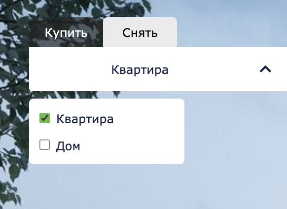

# ДЗ1 команды TeaStealers.

[TeaN](http://193.108.54.41/)

Данные тестового аккаунта:

Телефон - 9999999999
Пароль - Aa123123

Окружение: Google Chrome v.83.0.4103.61

## Профиль пользователя
### Страница профиля

1. Кнопка "Обновить фото" отрабатывает корректно, после выбора фотографии, фотография появляется в качестве аватара.

2. При приклеплении некорректного файла (формата не .png, .jpeg, .jpg) отображается ошибка.

3. При обновлении страницы аватар не загружается. <b>Баг</b>
4. В форме личной информации блокируется запрос обновления информации при заполнении имени и фамилии с использованием цифр, знаков, латиницы. Выводится сообщение "Можно использовать только кириллицу".

5. При задании имени и фамилии кириллицей запрос на изменение информации проходит успешно, выводится сообщение "Данные успешно сохранены".

6. При повторном нажатии на "Сохранить" сообщения дублируются. <b>Баг</b>

7. При переключении с другой страницы при незаполненных данных о пользователе поле ввода заполняется пробелом.

8. Смена телефона работает корректно, при вводе номера в формате +7 (999) 999-99-99 изменение информации проходит успешно, выводится сообщение "Данные успешно сохранены".
9. Форма проверяет формат вводимого номера (корректный формат - +7 (999) 999-99-99). В ином случае выводит сообщение об ошибке.

9. При вводе email в формате aa@aa.ru запрос на изменение информации походит успешно, выводится сообщение "Данные успешно сохранены".
10. Форма не позволяет заменить почту на невалидную, например aa@aaru (проверка структуры почтового адреса).

11. Форма не проверяет использование кириллицы и знаков. <b>Баг</b>

12. Форма изменения пароля осуществляет проверку на совпадение паролей (type изменен на text для наглядности).

13. Проверка старого пароля осуществляется корректно (нельзя изменить пароль на текущий).
14. Требования для нового пароля проверяются.

## Мои объявления

### Изменение объявления.

1. Нажатие на кнопку редактирования переводит на страницу создания с заполненной формой. 
2. При изменении данных на странице редактирования объявления и нажатии на кнопку "Сохранить изменения" происходит переход на страницу измененного объявления.
3. Форма не проверяет наличие изменений. <b>Баг</b>
4. Форма позволяет задать этаж выше этажности дома. <b>Баг</b>
5. Форма позволяет задать общую площадь меньше жилой. <b>Баг</b>

Иллюстрация, демонтсрирущюая результаты использования багов в п.4-п.5.

### Повысить рейтинг.

1. После нажатия на кнопку повышения рейтинга открывается модальное окно.

2. В поля формы можно вводить только цифры (корректно).
3. Номер карты валидируется, проверяется количество символов (12 символов, если меньше - выводится ошибка).

4. Дата "Годен до" - ошибка о просроченной карте выдаётся при вводе даты 04/24 и ранее. <b>Баг</b>

5. Ввод CVC - проверяется количество символов (ограничивает ввод 3 цифрами и выводит ошибку, если символов меньше).

6. После ввода количества баллов и нажатия кнопки "Подтвердить" окно закрывается, баллы начисляются корректно (что было + что ввели).
7. Текущий рейтинг в модальном окне отображается корректно (кол-во просмотров * 50 + кол-во лайков * 100 + донат).
8. Форма позволяет повысить рейтинг с просроченной картой. <b>Баг</b>

### Удаление объявления. 

1. По нажатию кнопки удаления объявление удаляется и пропадает со страницы "Мои объявления".

## Создать объявление
### Создание объявления квартиры

Проверял создание объявления на квартиру.
1. На странице при нажатии кнопки(объект недвижимости) - квартира видны следующие поля и в кнопки в описанном порядке:   
поля:   
тип аккаунта (кнопки: агент, собственник)  
сделка: (кнопки: аренда, продажа)  
объект недвижимости: (кнопки: квартира, дом/дача)  
адрес  
карта  
О здании  
Год постройки здания  
Высота потолков, м  
Этажей в доме  
<b>Параметры квартиры</b>  
Тип недвижимости(кнопки: Квартира, Апартаменты)  
Этаж;  Общая площадь  
Жилая площадь; Количество комнат;  
Описание объявления  
Загрузите фотографии (Выберите файл)  
Заголовок  
Описание  
Цена  
Телефон  
кнопка: Разместить объявление  
   

2. При сжатии страницы обнаружена ошибка в отображении страницы, пропадает карта, поля ввода попадают на сайдбар. <b>Баг</b>

3. Отметка на карте Ок. Загрузка фотографий Ок. Все поля заполняются, выводятся подсказки, если некорректно заполнены поля ввода.

   

4. Обнаружена ошибка, под кнопкой "Разместить объявление" при нажатии выводится, что "Жилая площадь больше общей площади", хотя поля заполнены корректно ("Общая площадь - 120", "Жилая площадь - 62"), <b>объявление не создаётся! Баг</b>

5. Объявление создаётся при нажатии на кнопку "Разместить объявление".

### Создание объявления дома
Проверял создание объявления на дом.
1. На странице при нажатии кнопки(объект недвижимости) - дом/дача видны следующие поля и в кнопки в описанном порядке:   
тип аккаунта (кнопки: агент, собственник)  
сделка: (кнопки: аренда, продажа)  
объект недвижимости: (кнопки: квартира, дом/дача)  
адрес  
карта  
О здании  
Год постройки здания  
Высота потолков, м  
Этажей в доме  
<b>Параметры дома </b>  
Тип дома(кнопки: Для постоянного проживания, Дача)  
Площадь дома;   
Площадь участка  
Количество спален;  
Состояние дома(кнопки: монжно жить; нужен ремонт; нужно достроить; нужен капремонт или под снос)  
Статус участка(кнопки: ИЖС; ДНП; Садоводство; Фермерское хозяйство; ЛПХ)  
Описание объявления  
Загрузите фотографии (Выберите файл)  
Заголовок  
Описание  
Цена  
Телефон  
кнопка: Разместить объявление  
   
   

2. При сжатии страницы обнаружена ошибка в отображении страницы, пропадает карта, поля ввода попадают на сайдбар(также как и при создании объявления квартиры). <b>Баг</b>

3. Отметка на карте Ок. Загрузка фотографий Ок. Все поля заполняются, выводятся подсказки, если некорректно заполнены поля ввода.

4. При нажатии на кнопку разместить объявление ничего не происходит, объявление не создаётся, при этом нет никаких сообщений об ошибках. <b>Баг</b>

## Сохранённые объявления

1. При лайке объявления оно добавляется в сохранённые.

2. Сохранённые объявления корректно отображаются.

3. При нажатии на корзину(красная кнопка) объявление удаляется из сохраненных.

4. При нажатии на объявление, происходит переход на него.

## Главная

1. При переходе на главную объявления подгружаются корректно

2. При нажатии на объявление, корректно происходит переход на него.
3. При нажатии на "Войти", корректно открывается окно авторизации.
4. При нажатии на "Разместить объявление", корректно происходит переход на создание объявления или на окно авторизации.

## Поиск

1. При нажатии на кнопки Купить/Снять, корректно происходит фильтрация по способу размещения.

 

3. Фильтр по типу жилья работает корректно.

 

4. Фильтр по кол-ву комнат работает корректно.

 

5. Фильтр по цене работает корректно.

 

6. Фильтр по адресу работает корректно.

 

7. Подсказка к полю "Адрес" при наведении подсвечивает всю область, хотя обработка стоит только на текст.

 

 

8. При нажатии на кнопку "Найти" все фильтры применяются корректно.

## Показать на карте

1. При нажатии на кнопку "Показать на карте" открывается модальное окно с картой.
2. Точки объявлений отображаются корректно

3. При клике на точку открывается информация об объявлении: неправильно накладывается на другие точки

4. При нажатии на краткую информацию об объявлении происходит переход на страницу объявления.
5. При уменьшении/увеличении карты точки отображаются корректно и не меняют размера. Кнопки "+" и "-" для изменения масштаба работают корректно.

6. При нажатии на задний фон (вне карты) окно карты закрывается.

## Страница объявления

1. Страница отображается корректно

2. Кнопка "Вернуться к списку" возвращает на главную страницу
3. При попытке поставить лайк неавторизованного пользователя появляется форма авторизации. Если пользователь авторизован лайк ставится и убирается корректно.

4. При нажатии на кнопку "Показать контакты" корректно отображается номер телефона

5. Нажатие на стрелки на фотографии работает корректно: фотографии листаются по кругу

## Авторизация/регистрация
### Авторизация
1. Ввод некорретных данных приводит к появлению соответствующих сообщений

2. Ввод правильных данных приводит к авторизации пользователя и закрытии формы авторизации.
3. Нажатие на "х" происходит закрытие формы
4. Нажатие на "Еще нет аккаунта?" направляет на форму регистрации. Аналогично кнопка "Уже есть аккаунт?" направляет на форму авторизации.

### Регистрация
5. Отправка пустых или некорректных данных приводит к появлению сообщений об ошибке

6. Не соблюдение правил создания пароля приводит к сообщению (поле пароля приведено к типу text для наглядности)

7. Если пароли не совпадают выводится сообщение (поле пароля приведено к типу text для наглядности)

8. Регистрация уже существующего номера телефона или почты приводит к ошибке

9. При корректных данных при регистрации пользователь сразу становится авторизованным, а окно регистрации закрывается.
